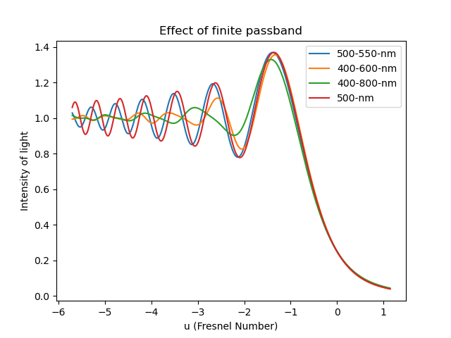

# Fresnel Diffraction

## Installation
### Requirements
1. Python 3.6 or higher
2. pip

### Setup Project
1. Fork the repository.
2. Clone the repository. In your terminal, type:
  <pre><code>git clone https://github.com/Anweshbyte/Diffraction---SPA615.git</code></pre>
3. Navigate to the repository directory : <code>cd Diffraction---SPA615</code>
4. Setup Python Virtual Environment : <code> virtualenv venv </code>
5. Activate the virtual environment. On Windows , <code>venv\Scripts\activate.bat</code>. On Linux/macOS, <code>source venv/bin/activate</code>.
5. Install the required modules : <code> pip install -r requirements.txt</code>
6. Run the **diff_mono** or **diff_poly** file based on your needs.
7. You can change the parameters from the **params.py** file.
8. Plot the obtained simulations by running **plotter.py**.

### Project Structure
1. **diff_mono**: Runs intensity simulations for a monochromatic light source.
2. **diff_poly**: Runs intensity simulations for a polychromatic light source.
3. **params.py**: Stores the wavelength (for monochromatic) and bandwidth (for polychromatic), and step size to consider the contribution from various frequencies in the bandwidth.
4. **plotter.py:** Generates the combined plots for all the run simulations.
5. **int_arr** directory stores the **Numpy** arrays of the calculated valued of the intensities.
6. **plots** contain the combined plots.

### Example Plot

Below is an example plot run for monochromatic and polychromatic (narrow, intermediate and wide bandwidths):

*Caption: Combined Fresnel Diffraction plots*

###Reference
[Website Name]([https://www.example.com](http://spiff.rit.edu/richmond/occult/bessel/bessel.html#:~:text=The%20term%20%22Fresnel%20diffraction%22%20is,and%20onto%20a%20distant%20screen.))

## License

This project is licensed under the MIT License - see the [LICENSE](LICENSE) file for details.
