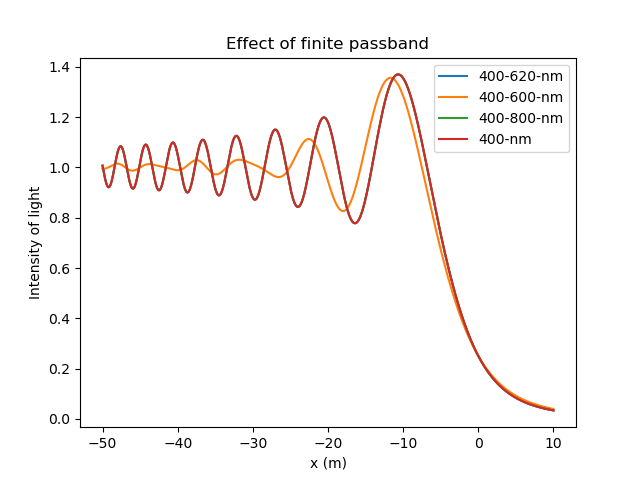

# Fresnel Diffraction

## Installation
### Requirements
1. Python 3.6 or higher
2. pip

### Setup Project
1. Fork the repository.
2. Clone the repository. In your terminal, type:
  <pre><code>git clone https://github.com/Anweshbyte/Diffraction---SPA615.git</code></pre>
3. Navigate to the repository directory : <code>cd Diffraction---SPA615</code>
4. Setup Python Virtual Environment : <code> virtualenv venv </code>
5. Activate the virtual environment. On Windows , <code>venv\Scripts\activate.bat</code>. On Linux/macOS, <code>source venv/bin/activate</code>.
5. Install the required modules : <code> pip install -r requirements.txt</code>
6. Adjust the parameters in **params.py**.
6. Run the **diffraction.py**.
7. Plot the obtained simulations by running **plotter.py**.

### Project Structure
1. **diffraction**: Runs intensity simulations for a mono/poly-chromatic light source.
2. **params.py**: Stores the wavelength (for monochromatic) and bandwidth (for polychromatic), and step size to consider the contribution from various frequencies in the bandwidth.
3. **plotter.py:** Generates the combined plots for all the run simulations.
4. **int_arr** directory stores the **Numpy** arrays of the calculated valued of the intensities.
5. **plots** contain the combined plots.

### Example Plot

Below is an example plot run for monochromatic and polychromatic (narrow, intermediate and wide bandwidths):

Combined Fresnel Diffraction plots*

### Reference
[Diffraction effects during a lunar occultation - Michael Richmond](http://spiff.rit.edu/richmond/occult/bessel/bessel.html#:~:text=The%20term%20%22Fresnel%20diffraction%22%20is,and%20onto%20a%20distant%20screen.)

## License

This project is licensed under the MIT License - see the [LICENSE](LICENSE) file for details.
